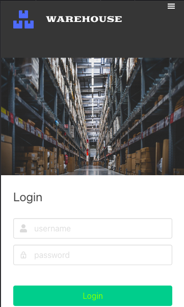
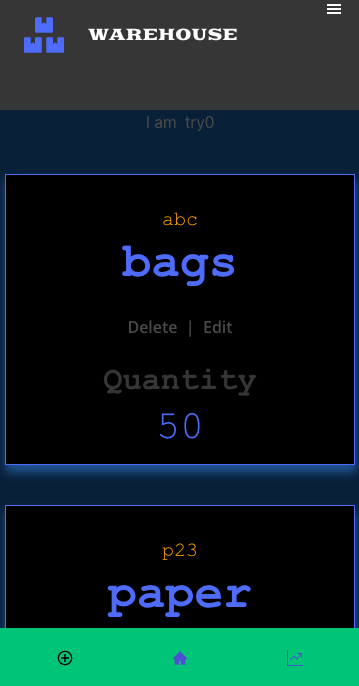
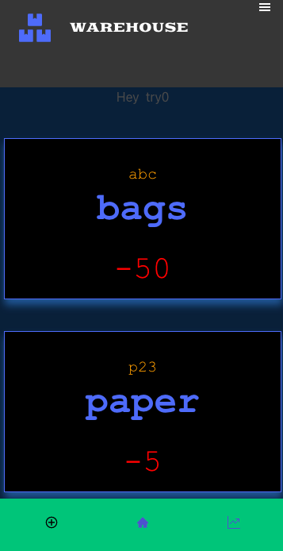

# WHAREHOUSE Tracking
 
> I have developed this Front-End application using the [warehouse-tracker-backend](https://github.com/brugobi/warehouse-tracker-backend/tree/backup). The app can help to keep track the quantity of material stored. The main features of this app are:

- Login with username and password
- Access list of materials
- Record the total quantity of material stored
- Record the total quantity of material needed or extra materials

### Pages








## Built With

- React & Redux
- JavaScript(ES6)
- gh-pages
- Node.js
- Bulma
- prop-types
- Jest
- Enzyme
- warehouse-tracker-backend API: [API](https://github.com/brugobi/warehouse-tracker-backend/tree/backup)
- Heroku

## Live Version

You can click on this [link](https://warehouse-front-bru.herokuapp.com/Login)

## Getting Started

### Prerequisites

- Node.js
- Any Brownse

To get started open the directory where you will save this repo by typing on your terminal:

```
$ cd <directory>
```

- Clone the repo typing:

```
$ git clone git@github.com:brugobi/warehouse-tracker-frontend.git
```
- Install dependencies:

```
$ npm install
```

### Usage

- After set up the environment, run:

```
$ npm start
```
- Open in the Browser:

```
http://localhost:3000
```

### Test

- To run the tests:

```
$ npm test
```

## Author

👤 **Bruna Gobi**

- Github: [@brugobi](https://github.com/brugobi)
- Twitter: [@BrunaGobi2](https://twitter.com/BrunaGobi2)
- Linkedin: [bruna-gobi](https://www.linkedin.com/in/bruna-gobi/)

## 🤝 Contributing

Contributions, issues and feature requests are welcome!

## Show your support

Give a ⭐️ if you like this project!
Feel free to check the [issues page](issues/).

## Acknowledgments

- Project requested by [Microverse Program](https://www.microverse.org/).
- The image was taken from THAM YUAN YUAN by [Pixabay](https://pixabay.com/pt/).

## 📝 License

This project is [MIT](lic.url) licensed.
